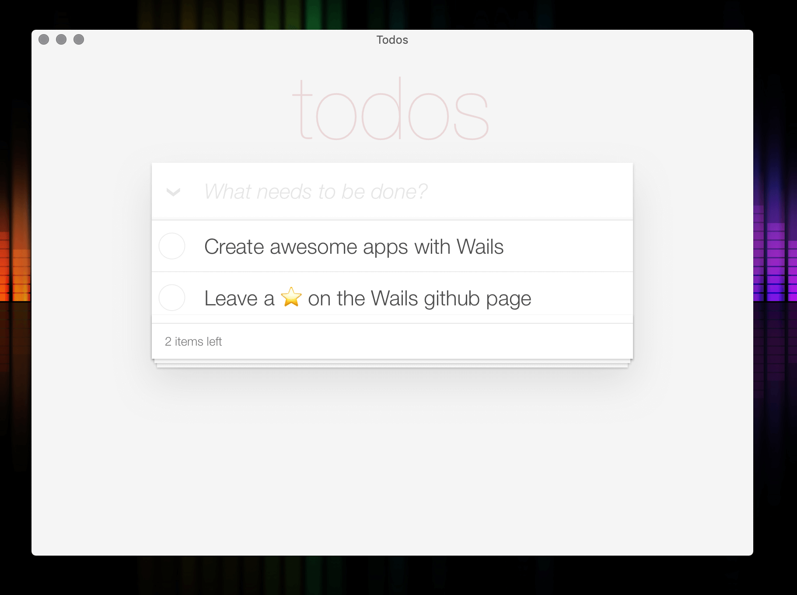

# Todo

  

This is the classic todo app for [Wails](https://github.com/wailsapp/wails)!

This forms part of the upcoming Wails tutorial.

## Setup

Run `wails build -p` to compile and package the application. 

## Run

 - OSX - Double click `todo.app`
 - Windows - Double click `todo.exe`
 - Linux - `./todo`

## Data File

The todo data is saved in your home directory under the file 'todos.json'.
